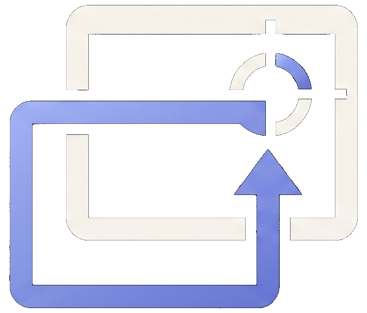
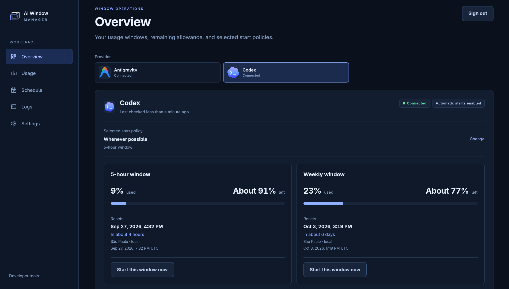
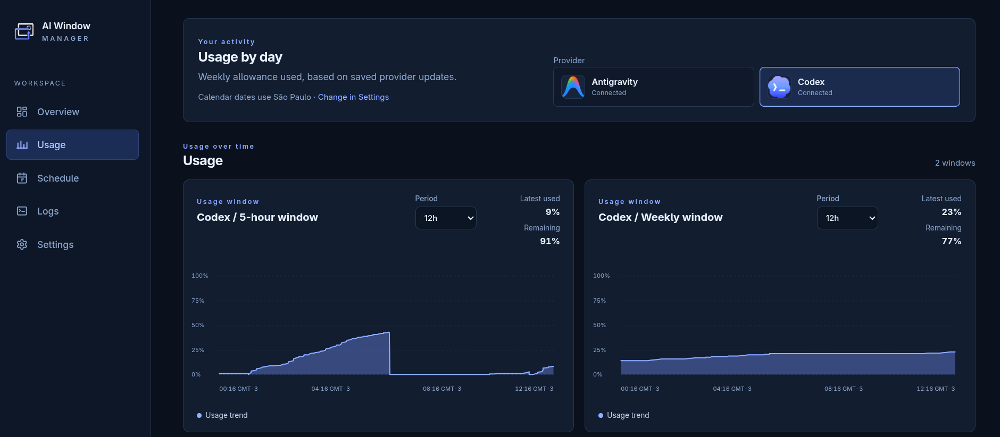
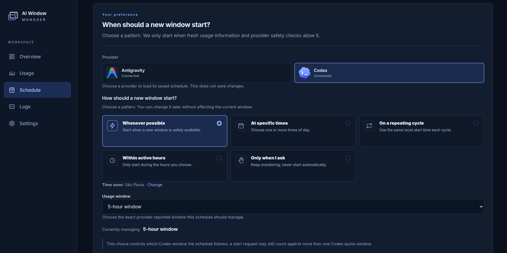
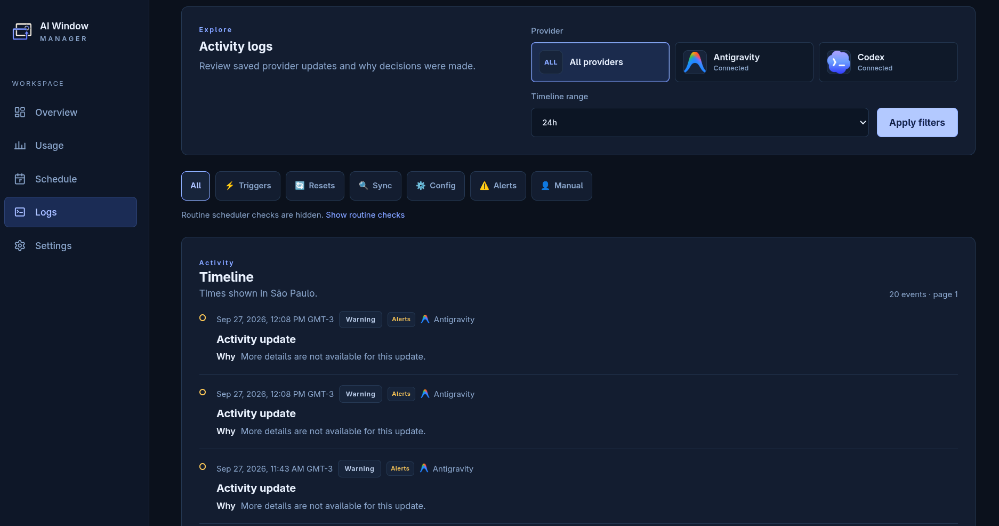

<p align="center">
  
</p>

<h1 align="center">AI Window Manager</h1>

<p align="center">Self-hosted monitoring and scheduling for Codex and Antigravity usage windows.</p>

<p align="center">
  
  
  
</p>

<p align="center">
  <a href="#screenshots">Screenshots</a> ·
  <a href="#features">Features</a> ·
  <a href="#providers">Providers</a> ·
  <a href="#scheduling">Scheduling</a> ·
  <a href="#deploy-with-docker">Docker setup</a> ·
  <a href="#documentation">Documentation</a>
</p>

AI Window Manager (AWM) observes provider usage windows, stores normalized
observations, and helps you decide when a new window should begin. It can send
an ordinary, minimal provider request when an enabled schedule and fresh safety
checks allow it, then tracks the outcome and displays usage and history in a
private web application.

AWM is a single-operator self-hosted service. It is not an LLM router, prompt
manager, agent orchestrator, account rotator, or rate-limit circumvention tool.

## Why AI Window Manager?

Some provider usage windows begin when you make a request, rather than at a
fixed time of day. AWM monitors reported reset times and lets you align window
starts with your schedule instead of checking providers manually.

## Features

- Monitor reported five-hour and weekly usage windows for Codex and Antigravity.
- Schedule starts by local times, a repeating cycle, active hours, or whenever
  a window is eligible; alternatively, keep automatic starts off and start a
  supported window yourself.
- Configure separate schedules for Antigravity's Gemini and Claude/GPT model
  families.
- Review status, usage charts, a daily usage heatmap, and paginated activity in
  the Overview, Usage, Schedule, and Logs pages.
- Connect provider accounts through guided flows in the web UI.
- Persist observations, settings, and action intents in SQLite; safely handle
  uncertain outcomes without blindly retrying a request.
- Manage pinned provider clients, check for updates, and roll back validated
  updates from Settings.
- Run as one hardened Docker Compose service with authenticated UI and
  Prometheus metrics.

## How it works

```text
provider client → validate observation → save state and history
                                      → evaluate schedule and safety checks
                                      → persist intent → optional request
                                      → verify result → show status in UI
```

The daemon reconciles providers independently of page views. UI and API reads
use persisted state; opening a dashboard does not itself inspect a provider.

> [!IMPORTANT]
> Starting a window sends a real provider request (currently a minimal `Hi!`)
> through the provider's official client. It can consume quota, including more
> than one provider allowance. AWM persists an intent before dispatch and does
> not blindly retry an uncertain result. Trigger conversations created for
> this purpose are disposable and cleaned up separately. See the
> [scheduling safety model](docs/scheduling.md).
>
> Antigravity's official CLI states that Google may collect and use interaction
> data under its terms and privacy policy; its settings provide an opt-out.
> Review that setting before connecting an account. AWM does not manage the
> provider's collection preference and does not retain the trigger response or
> conversation transcript. See [Security](docs/security.md#antigravity).

## Providers

| Provider           | Monitoring                                | Window start                                  | Authentication                                         |
| ------------------ | ----------------------------------------- | --------------------------------------------- | ------------------------------------------------------ |
| OpenAI Codex       | Official Codex app-server rate-limit data | Minimal app-server turn                       | Official OpenAI sign-in, guided in AWM                 |
| Google Antigravity | Official `agy` CLI usage output           | Normal prompt using the selected family model | Official Google sign-in through the CLI, guided in AWM |

Codex policies target one exact reported window at a time. Antigravity has
independent policies for **Gemini Models** and **Claude and GPT Models**; each
targets one exact five-hour or weekly window. Actions for the two Antigravity
families are serialized. Antigravity's trigger behavior is based on observed
CLI behavior, and the owner has confirmed the integrated flow for both
families on the tested setup. It is not a universal provider guarantee and may
evolve with releases; review the current [provider notes](docs/providers.md)
before enabling it.

## Scheduling

A **policy** answers when AWM may try to start a window. A **target window**
answers which exact provider-reported allowance the policy controls. A target
must be selected before AWM can plan an automatic start.

| Schedule option          | What it means                                                                                            |
| ------------------------ | -------------------------------------------------------------------------------------------------------- |
| **Whenever possible**    | Consider a start when the selected window is inactive and fresh observations and safety checks allow it. |
| **At specific times**    | Consider a start at one or more local clock times.                                                       |
| **On a repeating cycle** | Use a local anchor and the selected window's observed duration to calculate recurring opportunities.     |
| **Within active hours**  | Consider a start during configured daily hours when enough time remains in that period.                  |
| **Only when I ask**      | Continue monitoring, but do not create automatic starts; use the explicit manual action where supported. |

Times use the configured IANA timezone. A scheduled time is an opportunity,
not an unconditional timer: AWM checks freshness, window state, capability,
and pending actions. Missed opportunities are skipped rather than replayed
blindly after downtime. For the detailed rules, see
[Scheduling](docs/scheduling.md).

## Deploy with Docker

### Requirements

- Docker Engine and Docker Compose.
- Node.js 24+ and pnpm 10+ on the setup host to install dependencies and run
  the password-hash helper.
- A Linux Docker host. The current candidate has been built and smoke-tested on
  `linux/amd64`. The Dockerfile and CI also target `linux/arm64`, but arm64 is
  still unverified; do not treat it as release-supported until the candidate's
  cross-architecture CI build passes.

### 1. Clone and prepare the setup tools

```bash
git clone https://github.com/Nerver-zip/ai-window-manager.git
cd ai-window-manager
corepack enable
pnpm install --frozen-lockfile
```

### 2. Create the operator account

```bash
cp .env.example .env
chmod 600 .env
pnpm auth:hash
```

Enter and confirm a password at the hidden prompt. The command prints an
Argon2id PHC hash, not the password. Set the username and paste the complete
hash into `.env`, retaining the single quotes because the hash contains `$`:

```dotenv
AWM_AUTH_USERNAME=operator
AWM_AUTH_PASSWORD_HASH='<paste the generated Argon2id hash>'
```

Keep `.env` private and do not commit it. AWM's operator login is separate
from the Codex and Google provider sign-ins.

### 3. Review deployment settings

The checked-in `.env.example` is the full local `awm` profile:

| Setting                                                         | Example default        | Purpose                                                                              |
| --------------------------------------------------------------- | ---------------------- | ------------------------------------------------------------------------------------ |
| `AWM_HOST_BIND`                                                 | `0.0.0.0`              | Host interfaces that publish the web service. Use `127.0.0.1` for local-only access. |
| `AWM_HOST_PORT`                                                 | `8878`                 | Host port; the container listens on `8787`.                                          |
| `AWM_TIMEZONE`                                                  | `America/Sao_Paulo`    | Initial timezone used for schedules and date displays.                               |
| `AWM_CODEX_ENABLED` / `AWM_ANTIGRAVITY_ENABLED`                 | `true`                 | Enable the corresponding provider client.                                            |
| `AWM_CODEX_TRIGGER_ENABLED` / `AWM_ANTIGRAVITY_TRIGGER_ENABLED` | `true`                 | Allow that provider's trigger capability. Set `false` to opt out.                    |
| `AWM_ANTIGRAVITY_GEMINI_TRIGGER_MODEL`                          | `gemini-3.8-flash-low` | Model used for Gemini-family starts.                                                 |
| `AWM_ANTIGRAVITY_CLAUDE_GPT_TRIGGER_MODEL`                      | `claude-sonnet-4-6`    | Model used for Claude/GPT-family starts.                                             |

An enabled trigger gate does not itself send a request. Provider connection,
automation mode, an enabled schedule, and an exact target are still required.
After initialization, saved provider settings in SQLite are authoritative;
changing bootstrap environment values does not silently overwrite explicit
choices. See [Configuration](docs/configuration.md) for all options.

> [!WARNING]
> The example binds to all host interfaces for trusted-LAN use. AWM's login
> does not encrypt passwords or cookies over plain HTTP. Restrict access with
> the host firewall, do not forward the port from the public Internet, and use
> a VPN or TLS proxy on untrusted networks.

### 4. Validate and start

```bash
docker compose config --quiet
docker compose up --build -d --wait --wait-timeout 180
docker compose ps
curl --fail http://127.0.0.1:8878/healthz
```

Open [http://127.0.0.1:8878](http://127.0.0.1:8878) on the host, or
`http://<server-lan-ip>:8878` from an allowed LAN device. Sign in with
`AWM_AUTH_USERNAME` and the original password used to generate the hash.

### 5. Connect providers and choose a target

Use **Connect** on Overview or Settings and follow the in-app sign-in flow.
Credentials remain in the official provider clients' dedicated persistent
volumes; do not copy workstation credentials into the container. Verify that
the provider becomes connected and observations appear before configuring
starts.

On **Schedule**:

1. Select Codex or Antigravity.
2. For Antigravity, select **Gemini Models** or **Claude and GPT Models**.
3. Choose the exact reported five-hour or weekly window for that policy.
4. Choose a schedule option, configure its times if needed, and save.

No target is guessed. Monitoring can be checked without sending a
quota-consuming start request. See the [deployment guide](docs/deployment.md)
for troubleshooting and operational details.

## Using the app

| Page         | Use                                                                                               |
| ------------ | ------------------------------------------------------------------------------------------------- |
| **Overview** | Provider connection, current windows, freshness, and available start actions.                     |
| **Usage**    | Per-window usage charts and daily usage heatmap.                                                  |
| **Schedule** | Choose exact targets and configure start policies.                                                |
| **Logs**     | Search and page through persisted activity and decisions.                                         |
| **Settings** | Provider controls, timezone, authentication-independent preferences, and provider-client updates. |

## Screenshots

The overview is the main entry point. Expand the other screens to see usage,
scheduling, and activity details.



<details>
<summary>More app screens</summary>

**Usage — per-window charts and daily history**



**Schedule — provider, model family, target window, and start policy**



**Logs — paginated observations and decisions**



</details>

## Operating the container

```bash
docker compose ps
docker compose logs -f ai-window-manager
docker compose restart
docker compose up --build -d
docker compose down
```

Named volumes preserve state across container rebuilds and ordinary `down`:

| Compose volume            | Holds                                                       |
| ------------------------- | ----------------------------------------------------------- |
| `awm-data`                | SQLite settings, observations, history, and action intents. |
| `awm-codex-state`         | Codex client state and authentication.                      |
| `awm-antigravity-state`   | Antigravity CLI state and authentication.                   |
| `awm-antigravity-keyring` | Dedicated Antigravity keyring data.                         |
| `awm-provider-clients`    | Validated active provider-client versions.                  |

Do not use `docker compose down -v` unless you intend to delete these volumes,
including application history and provider sign-ins.

## Provider client updates

The image packages fixed official client versions from
[`provider-clients.lock.json`](provider-clients.lock.json). Settings can check
for a stable release, validate its published digest and read-only
compatibility, activate it atomically, or roll back to the packaged/previous
version. Automatic client updates are a separate setting from automatic
window starts. See
[Provider client operations](docs/deployment.md#provider-client-updates).

## Architecture and security

AWM is one Node.js service with a server-rendered Fastify UI, provider adapters,
a periodic reconciler, a durable action executor, and SQLite in WAL mode. There
is no Redis, external database, or provider call on dashboard reads. The
container runs non-root with a read-only root filesystem and restricted Linux
capabilities. AWM uses mandatory single-operator authentication; sessions are
in-memory and expire on restart. Application APIs require a session too.
Exact `GET`/`HEAD /metrics` can alternatively use an optional dedicated
read-only scraper token, configured only by its digest; see
[metrics authentication](docs/metrics.md#dedicated-scraper-authentication).

Historical data is bounded by retention: raw samples and ordinary events are
kept for 90 days, derived usage intervals for 400 days, and action/security
audit records for 365 days. Current state and unresolved action/cleanup records
are protected. See [Security](docs/security.md) and
[Persistence](docs/persistence.md).

## Development

Requirements: Node.js 24+ and pnpm 10+.

```bash
pnpm install --frozen-lockfile
pnpm auth:hash
```

Use FakeProvider for local development and tests; it is hidden by default in
the checked-in profile. Configure host provider executable paths before using
`pnpm dev`; the container paths in `.env.example` are not host paths. The
canonical local gate is:

```bash
pnpm validate
```

It runs formatting, lint, strict typechecking, tests with at least 90% lines,
statements, functions, and branches, production build, and Gitleaks. Normal
tests do not require provider credentials or spend real quota. See
[Development](docs/development.md) and [Testing](docs/testing.md).

## Documentation

- [Architecture](docs/architecture.md)
- [Deployment](docs/deployment.md)
- [Configuration](docs/configuration.md)
- [Scheduling](docs/scheduling.md)
- [Providers and evidence](docs/providers.md)
- [Security](docs/security.md)
- [Security reporting policy](SECURITY.md)
- [Contributing](CONTRIBUTING.md)
- [Persistence and retention](docs/persistence.md)
- [UI](docs/ui.md)
- [API](docs/api.md)
- [Product boundaries](docs/product-boundaries.md)
- [Backlog](docs/BACKLOG.md)

## Distribution and license

The AWM source is licensed under MIT; see [LICENSE](LICENSE). This project
distributes source code only: it does not publish an npm package or prebuilt
Docker image. Operators build the image locally with Docker Compose. That build
downloads the pinned official Codex and Antigravity clients from their upstream
release repositories; those clients, provider names, and logos remain subject to
their respective terms and are not relicensed by AWM. `package.json` stays
`private: true` because npm distribution is not part of this project.
